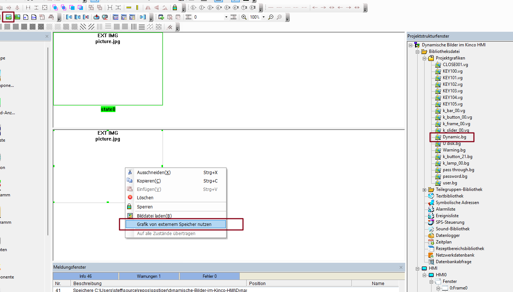
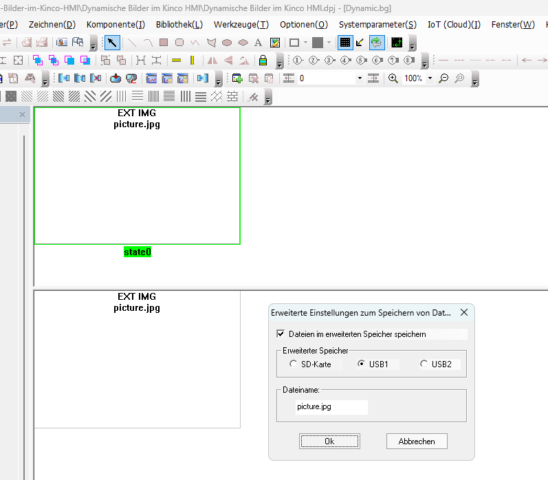
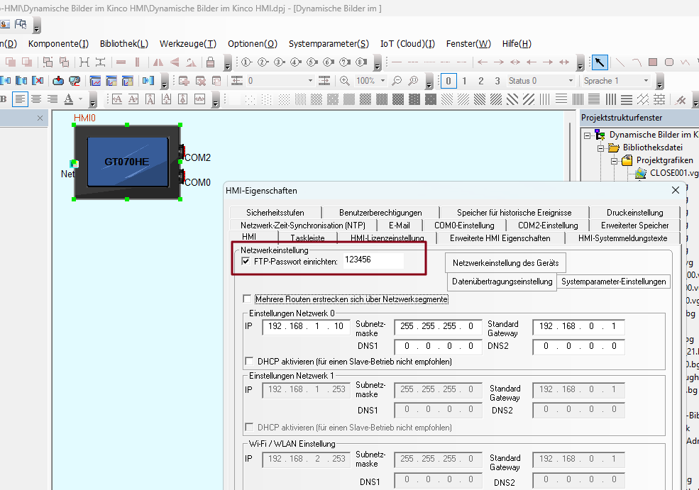
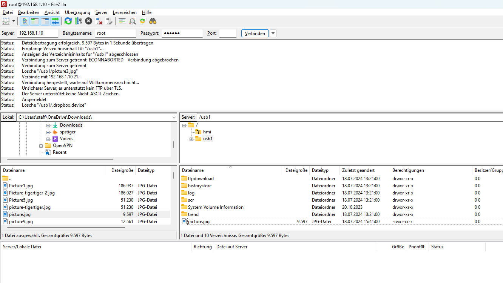

.zip)

# Kinco HMI Beispiel für die Anzeige einer dynamischen Bilddatei

In diesem Beispielprojekt für Kinco HMI zeigen wir euch, wie ihr eine externe Bilddatei **"picture.jpg"** auf einem USB-Stick auf dem HMI anzeigen könnt.
Mit einem Button für Systemregister LB9108 aktualisiert ihr das angezeigt Bild.
Es ist möglich, dieses Bild dynamisch über FTP über das HMI auf dem angeschlossenen USB-Stick zu aktualisieren.

*Demo für GT070HE*

*Das Bild "picture.jpg" wurde direkt auf dem USB-Stick über FTP ersetzt und aktualisiert*

## Benötigte Software und Zubehör

Entwicklungsumgebung für Kinco HMI [Kinco DTools](https://www.spstiger.de/moorl-dc-v2/85089e4d00614b9fb80f0dfebf415ee0/read?path=Kinco%20DTools/Kinco%20DTools%20V4.3.0.3(Build240415).zip) Vers. 4.3 oder höher

Es wird außerdem ein USB-Stick für das HMI benötigt.

## Wozu dieses Beispiel

In diesem Beispiel könnt ihr sehen, wie ihr Bilder dynamisch im HMI ersetzt, ohne das Programm neu zu übertragen. Das könnte zum Beispiel für **Produktfotos** beim Kunden relevant sein, die auf dem HMI angezeigt werden sollen oder für Bilder von Kameras z.B. **Wärmebildkameras**, die oft Bilder per FTP irgendwo speichern können.

## Funktionen und Komponenten

Dieses Beispielprogramm für die Kinco GT070HE HMI zeigt, wie ihr Bilder dynamisch ändert:

* **Bitlampe** als Grafikanzeige 
  *(Es ist aber jedes andere Element zur Anzeige von Grafiken möglich, zum Beispiel die Bitmapkomponente für eine statische Grafik.)*
* **Grafik mit verknüpfter Datei "picture.jpg" auf dem USB-Speicher des HMI in der Grafikbibliothek** für die Bildquelle
* **Button** mit Umschalter auf Systemvariable LB9108 zur Aktualisierung des Bildes
  *(Die Aktualisierung kann auch automatisch mit einem Timer mit Einstellung "periodische Umschaltung" erfolgen)*
* **Aktivierter FTP Server** mit user "root" und Passwort "123456", über den das Bild in Pfad "USB1" ersetzt werden kann

*Konfiguration des dynamischen Bildpfads in einer Bitmap-Grafik in DTools per Rechtsklick*

*Auswahl der Bilddatei auf dem USB-Speicher am HMI (die meisten Kinco HMI haben nur USB1, einige wenige Modelle haben USB2 und/oder SD-Karte)*

*Aktivierung der FTP-Funktion auf dem HMI in den Systemeinstellungen (der Nutzername ist root), das Passwort kann gewählt werden*

*Ersetzen der Datei "picture.jpg" auf Pfad USB1 über FTP am Beispiel Filezilla*
